# Burra-Carpentry-Landscaping

## Github Link:

[https://github.com/klps007/Burra-Carpentry-Landscaping](https://github.com/klps007/Burra-Carpentry-Landscaping)

## Deployed Links

[Heroku](https://burra-carpentry-landscaping.herokuapp.com/)

[Netlify](https://burra.netlify.com/)

## How to run the webapp locally:

cd into the frontend directory and run

```
yarn start
```

cd into the backend directory and run

```
npm start
```

## Login Credentials

In order to log into the admin area use these credentials

```
username: harrison
password: password
```

## PRG1006-7.1 & PRG1006-7.2 (Production and Development Testing)

### Manual Testing

We created a number of manual tests. Please click on the link below to view the spreadsheet with all the manual tests.

[Click here to get to the spreadsheet with all the manual test](https://docs.google.com/spreadsheets/d/1kBU7V0-GyVihzrNQEemNV51T6tdd0fyaT3xR4sCinUY/edit?usp=sharing)

### Usability Testing

We conducted a usability test with one participant who shall be referred to as the ‘user’. The user was first instructed to take a look at the home page and then tell us what they thought the website was about. The user was able to correctly identify that it was some kind of a landscaping business.

[Please click here to watch the screen recording of the user test](https://drive.google.com/open?id=1y5xVXNfc61Zzm-cN5EvR2cShYAQHjkIe)

Overall the user was pleased with the look and feel of the website as well as the usability. The user was easily able to figure out that in order to ‘find the prices’ they’d have to fill out the ‘get a quote’ form. The user was also able to identify that the gallery would contain images of previous work and that reviews would give them an insight into the reviews left by other customers.

Here are some of the usability issues that the user came across.
The user:
was a bit confused about the large images on the home page at first.

wondered why the admin login was visible. However the user didn’t mind that it is visible

was missing an email address in the footer section of the website. (The client prefers that the email is not displayed there but that potential customers use the ‘get quote’ form instead.

wanted to see a rough estimate for a price without having to request a quote. ( Again this is something that the client does not want to provide as it depends on so many different factors.)

noted that the review page didn’t state that it’s customer reviews, but figured they might be.

In the next iteration of the webapp, we would be addressing these usability issues in the following way:
Mention that the reviews are previous customer reviews.
Hide the admin login. It’s currently only there to make matters easier for those marking the webapp.
Do additional user testing to determine whether the size of the images on the homepage should be decreased.

## CMP1043-1.3 Libraries Used

Redux-form:
We used this in order to create our ‘get quote’ form. Redux form allows us to control the state of the form.

React:
This is the Javascript Library that we used in order to build our frontend components. Multiple components were rendered on a page in order to create the website. So for instance each page contained a navbar component, a footer component and several components in between.

React-Bootstrap / Bootstrap:
We used bootstrap in order to style our react components. It allowed us to give the website a uniform design.

React-Widgets:
We used the react widgets in order to create the ‘required services’ dropdown in the form. It allows users to select multiple things from the dropdown.

Axios:
We used axios in order to make calls to the backend to get the correct data displayed on the front end.

Testing-library:
We used cypress to test the functionality of our website and see whether things were working as intended.

## CMP1043-4.2 Dataflow Diagram

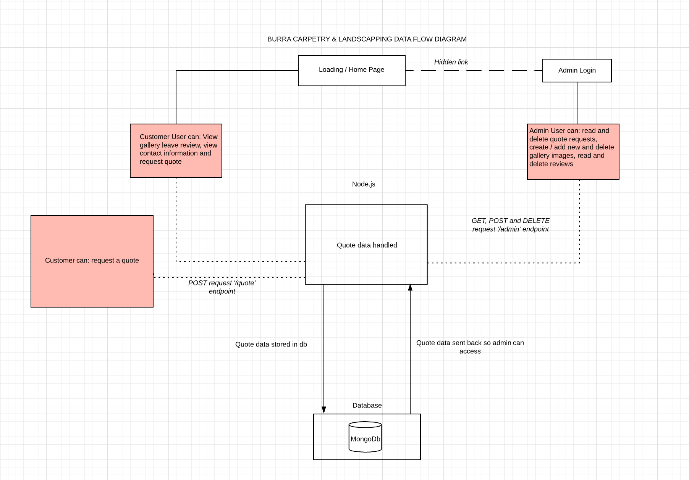

## CMP1043-4.3 Application Architecture Diagram

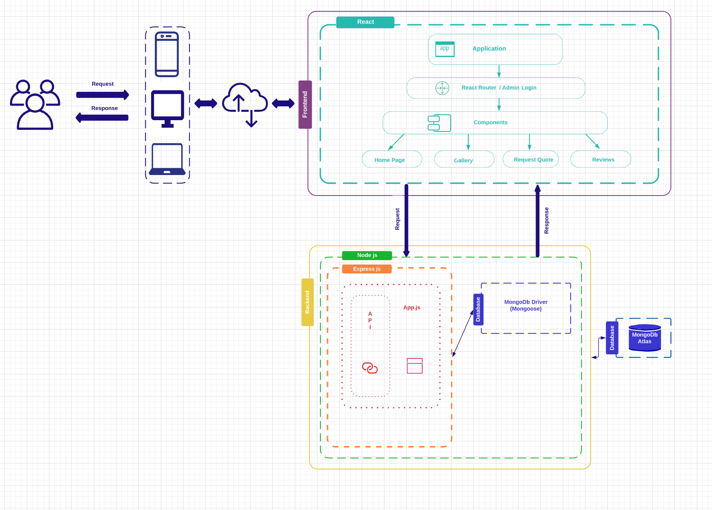

## CMP1043-5.1 User Stories and Personas

### Persona 1 - Jenny


Jenny, 29, Footscray

Jenny worked hard ever since she left university to save up enough money for a downpayment on a house. Last September she finally bought the house of her dreams in West Footscray. The property is a bit older than the other ones in the neighbourhood, but she figured that with a bit of extra work on the weekends she could fix it up in no time. However due to Jennys busy work schedule and social obligations she hasn’t gotten around to fixing up the front yard. Last year Jenny got a lot more money back from her tax returns than she expected and because she just moved into her own home, her friends and family gave her cash instead of presents for Christmas. Jenny would like to use some of that extra money that she got and pay someone to fix her front yard for her.
Jenny works very long hours in an office in the CBD of Melbourne. It’s an open plan office, so it’s difficult for her to talk on the phone during the day. She prefers to take care of things via text or email. She is somewhat patient, but does expect to get a swift answer any time she contacts customer support or a business for an inquiry.

### Persona 2 - Anahil


Anahil, 66, Richmond

This is Anahil. She worked as a Professor of Molecular Biology at the University of Melbourne.
Her children all moved out many years ago and her partner passed away recently.
Last year she retired and decided that it’s time to remodel her two-bedroom house in Richmond. She also wants to remodel the outdoor spaces of her home. She enjoys gardening and growing her own vegetables. She’s also always experimenting with creating new strains of rice that need less water than the conventional types.
She used a computer when she worked at the University, but outside of work she prefers to get her news from a print newspaper, reads physical books and goes to classical music concerts. She occasionally uses her laptop to print out the latest journal articles in the field of Molecular Biology, and to do some research. She has a cell phone but only uses it for a few minutes a day, to keep in touch with her two children via WhatsApp.

### User Stories

Jenny

- Wants to be able to get to the website and request a quote without any hassle.
- Wants to get contacted back via email or text and not phone.
- Expects to get some sort of feedback when she fills out a form online to know that it actually did go through.
- Usually accesses websites from her phone, doesn’t have patience for websites that are not mobile friendly.
- Wants to see some examples of what the business can do without having to read too much text.

Anahil

- Wants to be able to go to the website of a landscaping business that is not too overloaded with information, because a website that is heavily convoluted is difficult for her to navigate.
- Wants to be able to quickly find the phone number of the business so she can call them.
- Wants to see what type of landscapings they have done in the past. Ideally she wants to see some before and after pictures so she can assess what the skill level of the landscaper is.
- Wants to read what previous customers had to say about the business.
- Needs the website to have large enough fonts so that she can read what it says.

---

## CMP1043-4.1 & CMP1043-5.3 Wireframes and documentation

### Design process

We started out making lo fidelity paper prototypes like the one you can see below:

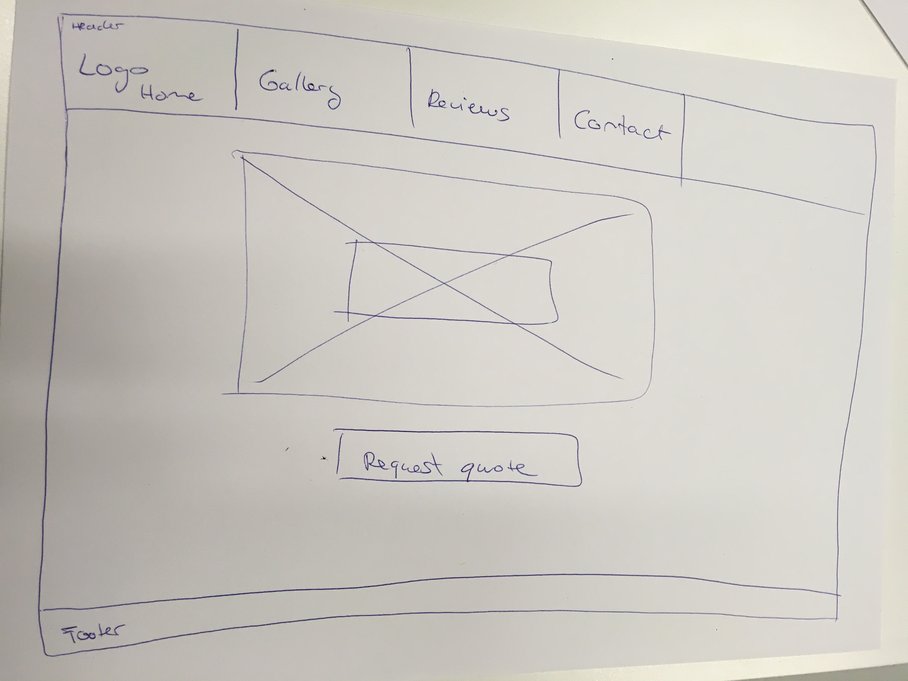

From there we started sketching things out on figma. You can see the wireframes in the next few sections below.

Eventually we created clickable prototypes, which you can in the last part of this section.

### Wireframes with comments

Below you can see the basic wireframes with comments.
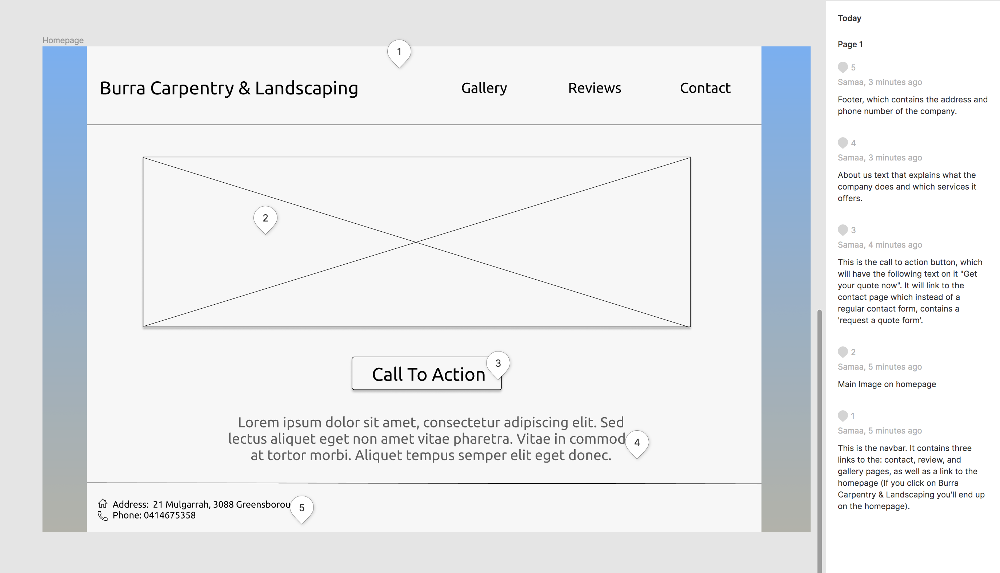

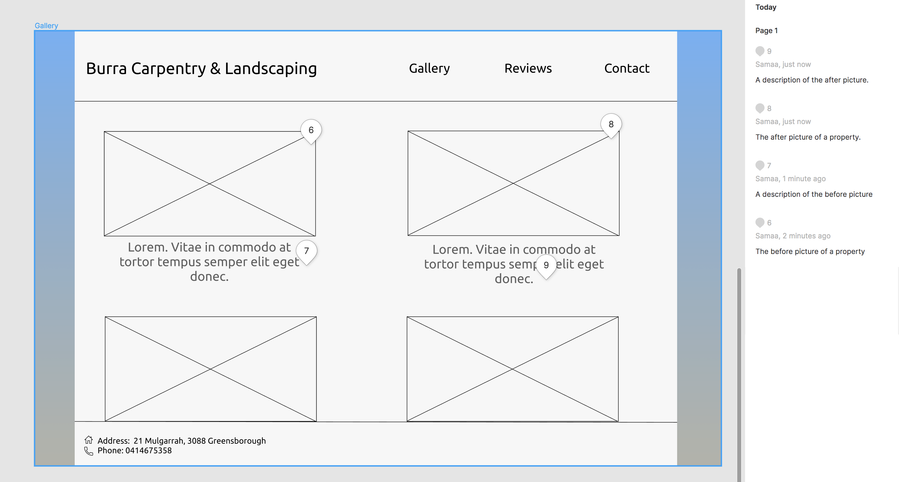

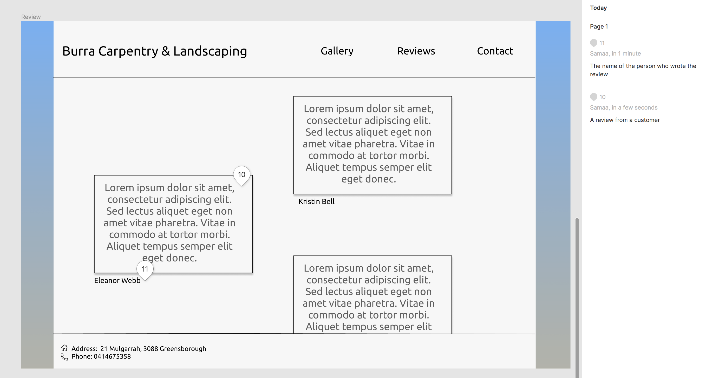

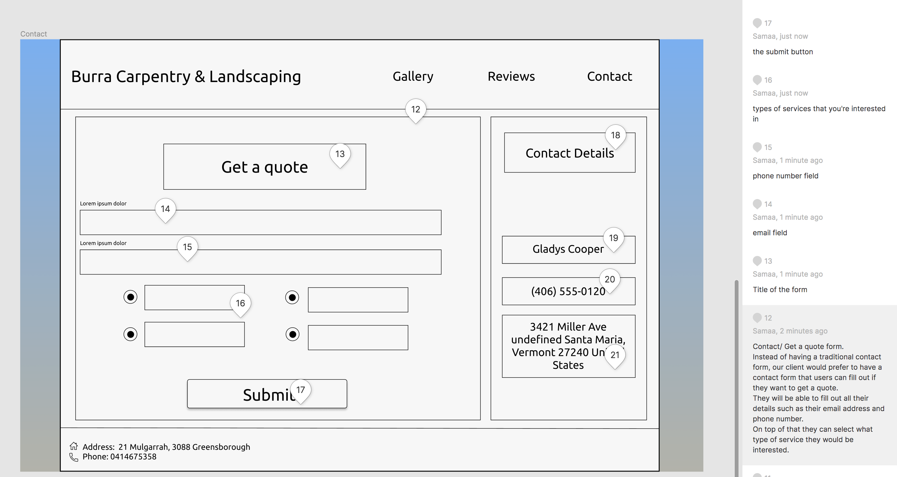

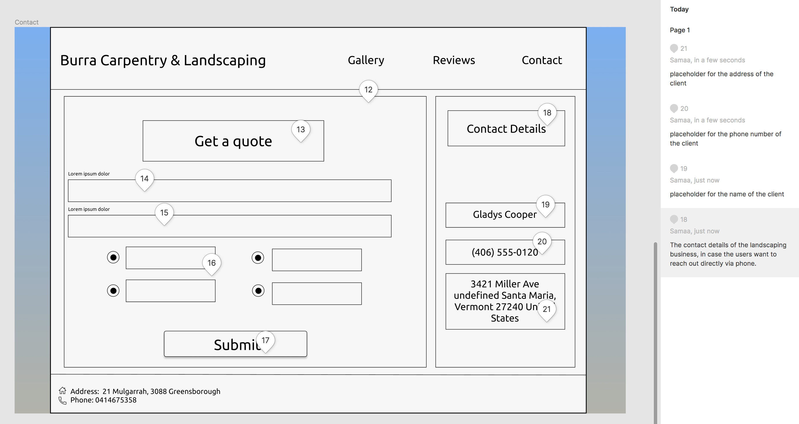

### Wireframes

- Desktop


[You can click here and view all the wireframes in detail on Figma](https://www.figma.com/file/619pg5Zna8cx6KPh7N3MrW/Burra-Carpentry-and-Landscaping?node-id=0%3A1)

- Mobile

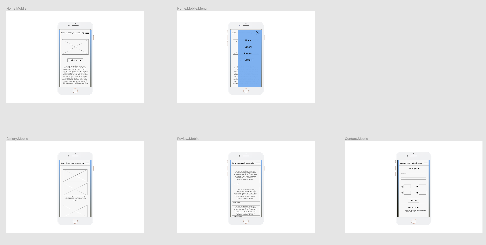

[You can click here and view all the wireframes in detail on Figma](https://www.figma.com/file/619pg5Zna8cx6KPh7N3MrW/Burra-Carpentry-and-Landscaping?node-id=0%3A1)

### Mobile Clickable Prototype:

[Click here to view the Mobile Prototype](https://www.figma.com/proto/619pg5Zna8cx6KPh7N3MrW/Burra-Carpentry-and-Landscaping?node-id=100%3A253&scaling=contain)

### Desktop Clickable Prototype:

[Click here to view the Desktop Prototype](https://www.figma.com/proto/619pg5Zna8cx6KPh7N3MrW/Burra-Carpentry-and-Landscaping?node-id=95%3A252&scaling=contain)

---

## CMP1043-5.2 Trello

[https://trello.com/b/7EXx1a8d/burra-carpentry-landscaping](https://trello.com/b/7EXx1a8d/burra-carpentry-landscaping)

Trello was used to allocate and track tasks, it includes sections for to do, doing and done and organizes tasks under each.

The task is assigned to them team member and the trello card moves from "To Do" to "Doing" and then "Done" column on completion.

This system made it easy for everyone to know what the everyone else was working on reducing conflict with pulling and pushing to github.

This results in agile methodology being implemented through out our project.


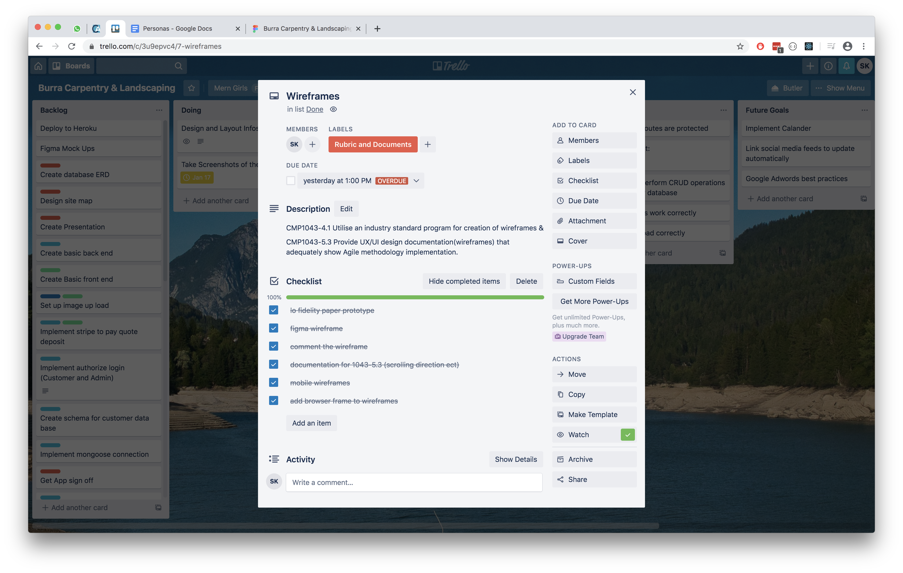
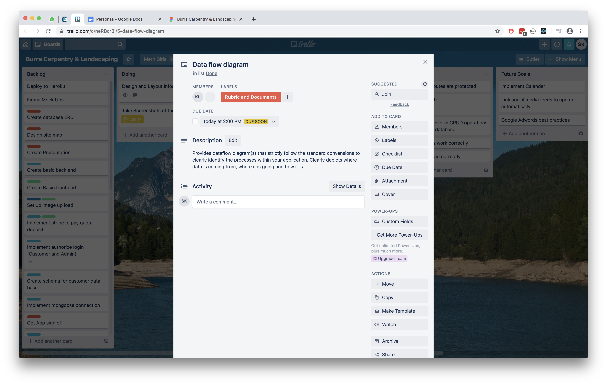
